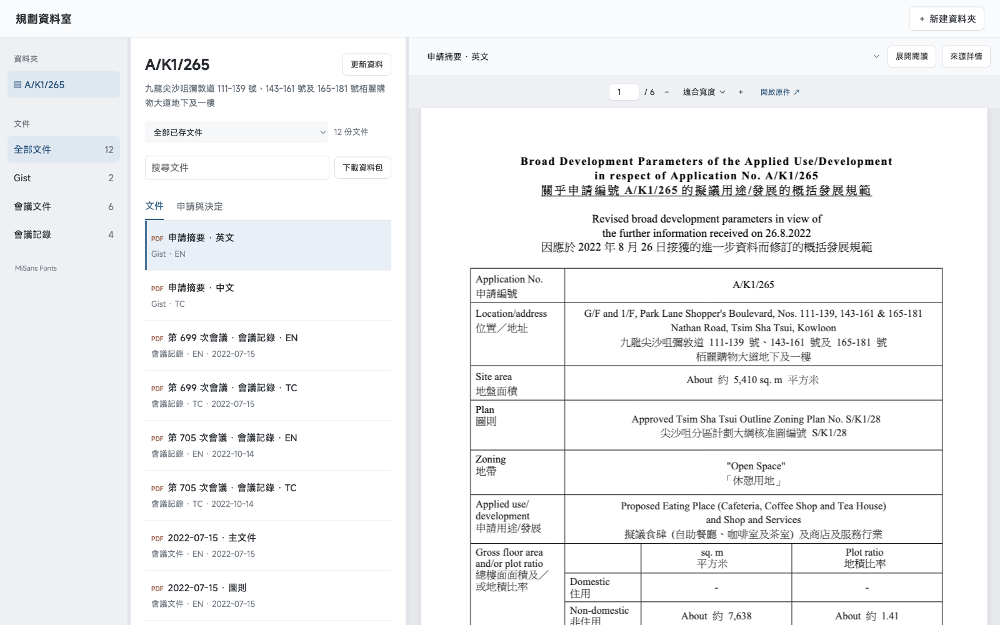

# 規劃資料室 · Planning Research Library

A local prototype for collecting, organising and reading official Hong Kong planning application documents.

輸入完整規劃申請編號，從官方來源搜集文件，在同一資料夾查看 Gist、會議文件與會議記錄，並保留來源和檢索歷史。



*已實作介面，展示公開申請 A/K1/265。新安裝的資料庫為空；截圖中的個人工作庫不隨程式發布。*

## Current features

- One folder per complete application number; related application numbers remain separate.
- Official-source discovery, original PDF retrieval and source metadata.
- Immutable retrieval history and date-scoped document views.
- A local PDF.js reader with focus mode, file switching, page/scroll/zoom restoration.
- ZIP export of original PDFs in the selected view.
- MiSans Latin and Traditional Chinese interface fonts.

## Run locally

Requirements: Python 3.11+ and Node.js 22+ with npm. Network access is required for installation and official-source collection.

```sh
git clone https://github.com/RainshadowQAQ/planning-research-library.git
cd planning-research-library
bash scripts/start.sh
```

Open **http://localhost:8765/**. First startup creates a Python virtual environment and installs/venders the locked PDF.js dependency. Create a folder using a complete application number, such as `A/K1/265`.

The application binds to loopback and enforces local-origin requests. This repository publishes source code; it is **not a hosted multi-user service or GitHub Pages deployment**.

## Storage and privacy

Local data is saved under `.data-library/`, including original documents, source request records and reading state. These runtime directories are ignored by Git and are not included here. Stop the service before backing up the complete directory. Do not expose this development server directly to the internet.

For isolated testing, use `bash scripts/start-test.sh` (port 8766, `.data-test/`). Keep test and daily data directories separate.

## Development

```sh
.venv/bin/python -m pytest -q
node --check web/app.js
node --check web/reader.js
```

The prototype's last development validation recorded 44 passing tests, plus browser checks for reading-state restoration and scoped ZIP contents. Tests use a small set of attributed, historical official-source fixtures. The browser is not launched by these commands.

Backend: FastAPI, SQLite and Python. Frontend: plain JavaScript modules and locally bundled PDF.js 6.3.289. See locked dependency files for versions.

## Scope and next steps

This is a working prototype. Official interfaces can change or fail, and historical completeness is not guaranteed. An application document's references do not establish the currently applicable OZP or planning position.

The following are **not implemented**: the newly approved three-column layout refinement, shared layered indexes with background freshness checks, cloud accounts, automatic summaries, highlights or annotations. Current collection can still wait for PDF downloads; it does not yet provide search-engine-style immediate indexing.

## Third-party materials

- The interface uses **MiSans Fonts**. Original WOFF2 assets and their [license](web/fonts/MiSans-License.pdf) are retained; see [font provenance](web/fonts/README.md).
- PDF.js is installed from its locked npm package; its license is copied into the local vendor output.
- Government-source test documents retain their original ownership. [Fixture provenance](docs/research/2026-09-05-api-feasibility/manifest.json) records source URLs and hashes. Their inclusion does not imply government endorsement.

No blanket license is applied to third-party materials. Public repository visibility alone does not grant an open-source license to the project's own code.
